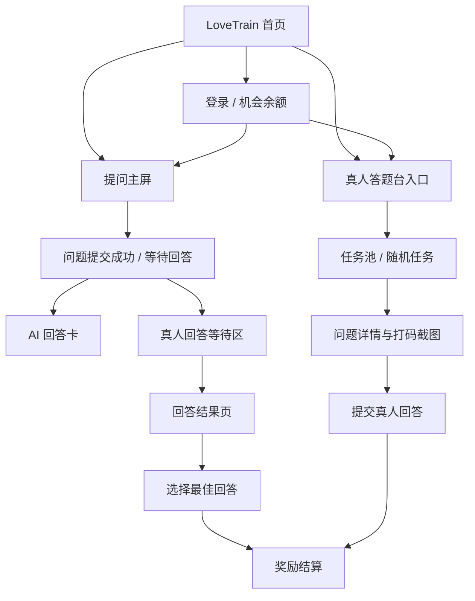

# LoveTrain 网站端问答产品规格

更新时间：2026-07-06  
目标版本：V1  
范围：网站端信息架构、主屏视觉稿、真人答题台与 AI/真人共同回答闭环

## 1. 背景

现有 LoveTrain 网页地址：

https://love-train-v12-cz63n5bqu-flyxqc1s-projects.vercel.app/

线上页当前定位为“爱之列车 — 情感导师”，核心描述是 AI 情感导师，帮助用户诊断关系、生成回复、复盘聊天、提升吸引力。

本次 V1 的目标不是重做完整产品，而是在现有 LoveTrain 网页上增加一个清晰的问答闭环：

1. 人类用户在网页端提出恋爱/情感问题。
2. AI 可以立即回答，给用户一个确定的即时反馈。
3. 真人答题者也可以在真人答题台领取或浏览问题，并提交回答。
4. 提问者最终可以看到 AI 回答与真人回答，并选择更有帮助的答案。
5. 真人答题者通过参与和被选中获得使用机会或奖励。

## 2. V1 产品目标

### 核心目标

把 LoveTrain 从“单向 AI 情感导师”升级为“AI + 真人共同回答”的问答产品。

### 用户价值

- 提问者：既能马上得到 AI 分析，也能获得真人视角，减少“AI 说得对不对”的不确定感。
- 答题者：通过回答别人的问题获得机会奖励，形成低成本内容供给。
- 产品：用真人回答补充 AI 情感建议的可信度，并沉淀高质量问答内容。

### V1 成功标准

- 用户可以在网页端提交一个文本问题。
- 用户提交后可以立即看到 AI 回答状态。
- 问题可以进入真人答题池。
- 真人答题者可以在 `human-answer.html` 中选择任务并提交回答。
- 提问者可以在同一个问题结果页看到 AI 回答和真人回答。
- 系统可以记录参与奖励和被选中奖励。

### V1 代码交付要求

V1 不是只交付 PRD、视觉稿或静态页面。验收口径必须是代码层面完成端到端数据流：

1. LoveTrain 网页端真实提交的问题必须写入后端。
2. 后端必须把问题投递到真人答题任务池。
3. 真人答题台必须从真实接口读取问题，而不是使用前端 mock 数据。
4. 真人提交的回答必须写回后端，并能回到提问者结果页展示。
5. AI 回答和真人回答必须挂在同一个 `Question` 下，便于提问者对比和选择。
6. 参与奖励和被选中奖励必须产生可追踪的后端记录。
7. 上线前必须完成端到端测试，证明“网页提问 -> 答题台看到 -> 真人回答 -> 提问者看到回答”这一链路可用。

## 3. 用户角色

### 提问者

在 LoveTrain 网页提出恋爱、聊天、暧昧、复盘、冲突修复等问题的人。

### 真人答题者

进入真人答题台，阅读已打码问题并提交建议的人。

### AI 回答者

系统内置回答能力，负责即时生成关系判断、风险提醒和回复建议。

### 运营/审核者

处理隐私打码、违规问题、未打码举报、真人回答质量和滥用风险。

## 4. 网站端信息架构



### 顶层导航

V1 导航建议：

- 首页
- 体验 AI 恋爱导师
- 真人答题台
- 学习提升
- 个人中心

### 页面清单

| 页面 | 路径 | V1 作用 | 状态 |
| --- | --- | --- | --- |
| LoveTrain 首页 | `/` | 承接品牌、提问入口和核心说明 | 已有，需接入提问主屏 |
| 提问主屏 | `/` 首屏或 `/ask` | 用户输入问题、上传截图、选择场景 | 待落地 |
| 问题结果页 | `/questions/:id` | 展示 AI 回答、真人回答、等待状态和选择操作 | 待落地 |
| 真人答题台 | `/human-answer` | 真人答题者查看任务、倒计时、提交答案 | 已完成静态版 |
| 个人中心 | `/account` | 展示机会、回答记录、被选中记录 | 已有基础页，待接入数据 |
| 审核后台 | `/admin/questions` | 处理打码、举报、问题下架 | V1 可先内部接口，不做完整 UI |

## 5. 主屏视觉稿

V1 主屏应当直接把“提问”作为第一屏核心，不做营销页优先。

### 桌面端首屏线框

```text
┌────────────────────────────────────────────────────────────────────┐
│ LoveTrain     体验AI恋爱导师   真人答题台   学习提升   个人中心      │
├────────────────────────────────────────────────────────────────────┤
│                                                                    │
│  左侧：提问区                                                       │
│  ┌──────────────────────────────────────────────┐                 │
│  │  标题：把聊天困惑丢上来，AI 和真人一起答       │                 │
│  │  副标题：先给 AI 即时分析，再等真人补充视角     │                 │
│  │                                              │                 │
│  │  场景选择：不知道怎么回 / 对方变冷 / 吵架修复  │                 │
│  │  文本输入：描述背景或粘贴聊天记录              │                 │
│  │  上传截图：可选，提交前提醒隐私打码            │                 │
│  │                                              │                 │
│  │  主按钮：提交问题                             │                 │
│  │  次按钮：先看示例                             │                 │
│  └──────────────────────────────────────────────┘                 │
│                                                                    │
│  右侧：回答机制预览                                                 │
│  ┌──────────────────────────────────────────────┐                 │
│  │  AI 回答：立即生成关系判断、风险提醒、回复建议  │                 │
│  │  真人回答：进入匿名任务池，限时收集真实视角      │                 │
│  │  选择奖励：提问者选中后，真人答题者获得奖励      │                 │
│  │  隐私保护：头像、昵称、手机号、微信号必须打码    │                 │
│  └──────────────────────────────────────────────┘                 │
│                                                                    │
└────────────────────────────────────────────────────────────────────┘
```

### 移动端首屏结构

1. 顶部品牌与机会余额。
2. 单列提问输入框。
3. 场景快捷按钮。
4. 上传截图入口和隐私提醒。
5. 提交按钮。
6. AI/真人回答机制的简短说明。

### 视觉风格

- 延续当前 LoveTrain 暖米白背景、橙色强调、深色文字。
- 主按钮使用高识别度橙色，强调“提交问题”。
- 回答机制预览使用轻量分栏，不使用复杂营销卡片。
- 隐私打码提示必须在上传截图前后都出现。
- 真人答题台可以保留任务感，但默认 V1 应以可信赖工具感为主。

## 6. 已完成设计和代码

### 已完成页面

| 文件 | 内容 | 当前状态 |
| --- | --- | --- |
| `human-answer.html` | 真人答题台页面结构，包括任务池、当前任务、打码截图预览、回答输入、规则、奖励和数据面板 | 已完成静态版 |
| `human-answer.css` | 独立工作台样式，包含三栏布局、移动端响应式、任务卡、隐私提示、奖励面板和 toast 样式 | 已完成静态版 |
| `human-answer.js` | 任务池 mock 数据、倒计时、筛选、任务切换、提交校验、机会奖励和在线人数模拟 | 已完成静态交互 |
| `index.html` | 首页导航需新增“真人答题台”入口 | 本次补齐 |

### 已完成交互能力

- 任务池展示多个情感问题。
- 支持“全部 / 可答 / 即将超时”筛选。
- 支持点击任务切换当前问题。
- 当前任务展示聊天截图风格预览和 OCR 摘要。
- 支持回答输入，至少 10 字才能提交。
- 支持 Enter 提交、Ctrl/Meta/Shift + Enter 换行。
- 支持倒计时，超时后显示 AI 已兜底。
- 支持提交后参与奖励 +1 次机会。
- 支持“发现未打码内容”举报提示。

### 当前代码边界

- `human-answer.js` 仍是前端 mock 数据，没有接入真实后端。
- 真人回答提交只更新本地状态，没有写入数据库。
- AI 兜底只是状态展示，没有绑定真实 AI 回答记录。
- 机会奖励是本地模拟，没有结算流水。
- 未实现提问者问题结果页。
- 未实现提问入口与真人答题台之间的数据流。

## 7. V1 用户流程

### 流程 A：提问者提交问题

1. 用户进入 LoveTrain 首页。
2. 用户选择问题场景，例如“对方变冷”“不知道怎么回”“吵架修复”。
3. 用户输入问题背景，也可以上传聊天截图。
4. 系统提示隐私打码，必要时自动识别敏感信息。
5. 用户提交问题。
6. 系统创建 `Question`，状态为 `submitted`。
7. 系统立即触发 AI 回答。
8. 系统将问题投递到真人答题池。

### 流程 B：AI 回答

1. AI 读取问题背景、聊天文本和场景。
2. AI 输出结构化回答：
   - 当前关系判断
   - 对方信号
   - 用户主要风险
   - 下一步策略
   - 可复制回复
   - 安全边界提醒
3. AI 回答写入 `Answer`，类型为 `ai`。
4. 提问者结果页展示 AI 回答。

### 流程 C：真人回答

1. 真人答题者进入 `/human-answer`。
2. 系统展示可回答问题或派发随机问题。
3. 答题者阅读已打码聊天截图和 OCR 摘要。
4. 答题者在倒计时内提交回答。
5. 回答写入 `Answer`，类型为 `human`。
6. 系统给答题者参与奖励 +1。
7. 提问者结果页展示真人回答。

### 流程 D：提问者选择答案

1. 提问者在结果页看到 AI 回答和真人回答。
2. 提问者可以收藏、复制、举报或选择最佳回答。
3. 如果选择真人回答，系统给该答题者被选中奖励 +5。
4. 问题状态更新为 `resolved`。

## 8. 数据模型

### Question

| 字段 | 类型 | 说明 |
| --- | --- | --- |
| `id` | string | 问题 ID |
| `askerId` | string | 提问者 ID |
| `scenario` | string | 场景分类 |
| `content` | string | 用户问题文本 |
| `imageUrl` | string | 可选，截图地址 |
| `ocrText` | string | 可选，OCR 文本 |
| `maskedImageUrl` | string | 可选，打码后的截图 |
| `status` | string | `submitted` / `ai_answered` / `human_answering` / `resolved` / `closed` |
| `createdAt` | datetime | 创建时间 |
| `expiresAt` | datetime | 真人回答窗口结束时间 |

### Answer

| 字段 | 类型 | 说明 |
| --- | --- | --- |
| `id` | string | 回答 ID |
| `questionId` | string | 所属问题 |
| `answererId` | string | 回答者，AI 可使用系统 ID |
| `type` | string | `ai` / `human` |
| `content` | string | 回答正文 |
| `status` | string | `pending` / `visible` / `selected` / `reported` / `hidden` |
| `createdAt` | datetime | 创建时间 |

### RewardLedger

| 字段 | 类型 | 说明 |
| --- | --- | --- |
| `id` | string | 流水 ID |
| `userId` | string | 用户 ID |
| `questionId` | string | 关联问题 |
| `answerId` | string | 关联回答 |
| `delta` | number | 奖励变动，参与 +1，被选中 +5 |
| `reason` | string | `submit_answer` / `selected_answer` / `manual_adjust` |
| `createdAt` | datetime | 创建时间 |

## 9. 接口设计

V1 可以在现有 LoveTrain API 基础上增加以下接口。

| 接口 | 方法 | 说明 |
| --- | --- | --- |
| `/api/questions` | `POST` | 创建问题，触发 AI 回答和真人任务投递 |
| `/api/questions/:id` | `GET` | 获取问题详情、AI 回答、真人回答和状态 |
| `/api/questions/:id/select-answer` | `POST` | 提问者选择最佳回答 |
| `/api/human/tasks` | `GET` | 获取真人可答任务池 |
| `/api/human/tasks/claim` | `POST` | 领取一个任务，V1 可选 |
| `/api/human/answers` | `POST` | 提交真人回答 |
| `/api/rewards/me` | `GET` | 获取我的机会余额和奖励记录 |
| `/api/moderation/report` | `POST` | 举报未打码内容或低质量回答 |

### AI 回答复用策略

现有线上 LoveTrain 前端已存在聊天提交能力，V1 可优先复用 `/api/chat` 的 AI 生成能力。新增问题系统只负责把一次聊天请求包装成可追踪的 `Question` 和 `Answer`。

## 10. 隐私和安全边界

### 必须实现

- 上传截图前提示用户打码。
- 服务端保存前执行敏感信息识别。
- 对真人答题者只展示必要上下文。
- 头像、昵称、手机号、微信号、二维码、地址等信息必须遮盖。
- 真人答题者提交内容需要基础安全检查。
- 提问者和答题者默认匿名。

### 禁止方向

- 不允许真人答题者联系提问者。
- 不允许展示未打码原图给非审核角色。
- 不允许用回答诱导骚扰、控制、跟踪、威胁或持续打扰明确拒绝的人。
- AI 与真人回答都不能承诺“保证复合”“保证拿下”。

## 11. 待落地执行功能

### P0

- 首页新增“真人答题台”导航入口。
- 新增 `website-product-spec.md`，统一产品范围和执行口径。
- 提问主屏：场景选择、文本输入、截图上传入口、隐私提醒、提交按钮。
- 问题创建接口。
- AI 回答写入问题结果页。
- 真人答题台接入真实任务接口。
- 真人回答提交接口。
- 提问端、AI 回答、真人答题台、结果页之间的后端数据流打通。
- 用真实接口替换 `human-answer.js` 中的任务 mock 数据。
- 完成端到端测试并记录测试结果。

### P1

- 提问者结果页：AI 回答、真人回答、等待倒计时、选择最佳回答。
- 奖励流水：参与 +1、被选中 +5。
- 未打码举报闭环。
- 简单答题记录页。
- 问题关闭和超时逻辑。

### P2

- 随机领任务模式，吸收“抢单/派单”的任务感，但不作为默认 V1 主流程。
- 排行榜和等级。
- 真人回答质量评分。
- 优质回答沉淀为公开 FAQ。
- 管理后台完整 UI。

## 12. 验收标准

### 端到端链路

- 在 `https://love-train-v12-cz63n5bqu-flyxqc1s-projects.vercel.app/` 提交的新问题，可以生成后端 `Question` 记录。
- 该问题可以通过真人答题台任务接口返回。
- 真人答题台可以展示该问题，而不是展示固定 mock 任务。
- 真人答题者提交回答后，后端可以生成 `human` 类型 `Answer` 记录。
- 提问者结果页可以看到同一个问题下的 AI 回答和真人回答。
- 刷新页面后，问题、回答和奖励状态仍然存在。

### 提问端

- 用户可以提交一个不少于 10 字的问题。
- 提交后创建问题 ID。
- AI 回答成功后展示在结果页。
- AI 失败时展示明确失败状态，并允许重试。

### 真人答题端

- 真人答题台可以展示真实问题。
- 任务状态包含可答、即将超时、AI 已兜底、已提交。
- 回答少于 10 字不能提交。
- 提交后生成 `human` 类型回答。
- 提交后奖励流水增加 +1。

### 选择和奖励

- 提问者可以选择一个最佳回答。
- 选择真人回答后，该答题者奖励流水增加 +5。
- 同一个问题只能选择一次最佳回答。

### 隐私

- 真人答题者不可看到提问者身份。
- 未打码举报后，该任务暂停分发。
- 被举报内容进入审核状态。

## 13. 测试计划

### 单元/接口测试

- `POST /api/questions`：创建问题，校验必填字段、最小字数和返回问题 ID。
- `GET /api/human/tasks`：只返回可答且已完成隐私处理的问题。
- `POST /api/human/answers`：提交真人回答，校验字数、任务状态和重复提交。
- `POST /api/questions/:id/select-answer`：同一个问题只能选择一次最佳回答。
- 奖励流水：参与答题 +1，被选中 +5，重复提交不重复加奖励。

### 端到端测试

- 用测试用户 A 在 LoveTrain 网页提交一个问题。
- 等待或触发 AI 回答生成。
- 用测试用户 B 打开真人答题台，确认能看到 A 提交的问题。
- B 提交真人回答。
- A 打开问题结果页，确认能看到 AI 回答和 B 的真人回答。
- A 选择 B 的真人回答为最佳回答。
- 验证 B 的奖励余额增加，奖励流水可查。

### 回归测试

- AI 回答失败时，问题仍然进入真人答题池。
- 真人答题窗口超时后，答题台不允许继续提交。
- 举报未打码内容后，任务从可答列表移除。
- 刷新页面后，问题状态、回答内容和奖励状态不丢失。

## 14. 主要风险

| 风险 | 影响 | V1 对策 |
| --- | --- | --- |
| 截图隐私泄露 | 高 | 上传前提示 + 自动检测 + 举报暂停分发 |
| 真人回答低质量 | 中 | 字数门槛 + 提问者选择 + 后续评分 |
| AI 回答已经足够，真人供给不足 | 中 | AI 先答，真人作为补充，不阻塞体验 |
| 奖励被刷 | 中 | 每用户每日上限、重复内容检测、异常答题频率限制 |
| 情感建议越界 | 高 | 安全提示词、敏感场景拦截、举报与下架 |

## 15. 当前执行清单

- [x] 完成真人答题台静态页面：`human-answer.html`
- [x] 完成真人答题台样式：`human-answer.css`
- [x] 完成真人答题台本地交互：`human-answer.js`
- [x] 补齐首页“真人答题台”入口：`index.html`
- [x] 输出网站端产品规格：`website-product-spec.md`
- [ ] 接入真实问题 API
- [ ] 接入 AI 回答结果页
- [ ] 接入真人提交接口
- [ ] 接入奖励流水
- [ ] 接入隐私审核和举报暂停分发
- [ ] 替换真人答题台 mock 数据为真实接口数据
- [ ] 完成端到端测试并提交测试记录
